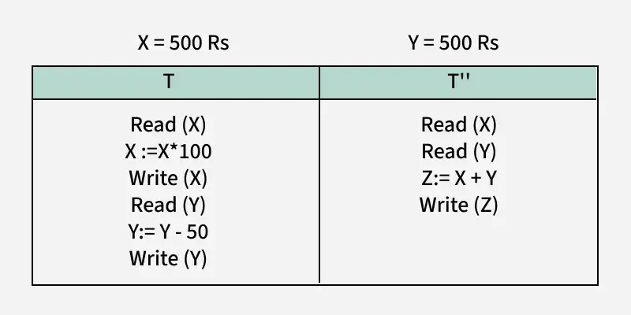

# ACID Properties  

ACID stands for Atomicity, Consistency, Isolation, and Durability. These properties ensure that database transactions are processed reliably.  

### 1. Atomicity  

The term **atomicity** defines that the data remains atomic. It means if any operation is performed on the data, either the entire transaction takes place at once or doesn’t happen at all. There is no midway, i.e., transactions do not occur partially. If a transaction fails anywhere at any point just before the commit, then it will be rolled back, meaning any operation on the transaction will not be executed, and all the operations will be rolled back.  


#### Example:  
  
Imagine we are building a banking app that transfers $100 from Alice to Bob. This means updating two things:  
1. Subtracting $100 from Alice's balance.  
2. Adding $100 to Bob's balance.  

**Atomicity** ensures that both updates either happen together or not at all.  

If something fails midway, the transaction management system will use the logs to undo any partial changes, so we won’t end up losing or gaining extra money.  


  

### 2. Consistency  

The **Consistency** property ensures that a database remains in a valid state before and after a transaction. This means that any transaction must transition the database from one consistent state to another, preserving all defined rules and constraints.  

In essence, the sum of all values in the system must remain the same throughout the transaction, ensuring data accuracy and integrity.  

#### Example:  
  
Consider a system with three accounts: A, B, and C. Account A initially has $300, while accounts B and C each start with $100. A series of transactions is performed as follows:  

1. **Transaction 1**: Account A debits $50 to account B.  
   - Before the transaction:  
     - Account A: $300  
     - Account B: $100  
   - After the transaction:  
     - Account A: $250  
     - Account B: $150  

   The sum of money remains consistent:  
   $300 (A) + $100 (B) = $250 (A) + $150 (B) = $400  

2. **Transaction 2**: Account A debits $20 to account C.  
   - Before the transaction:  
     - Account A: $250  
     - Account C: $100  
   - After the transaction:  
     - Account A: $230  
     - Account C: $120  

   Again, the sum of money remains consistent:  
   $250 (A) + $150 (B) + $100 (C) = $230 (A) + $150 (B) + $120 (C) = $400  

The system consistently ensures that all transactions are executed correctly, and the total sum of money ($400) remains unchanged before and after the operations.  

If, at any point, the values in B or C incorrectly reflect the balance of $300 in A (due to an incomplete  debit operation), the data would be considered inconsistent.


### 3. Isolation  

**Isolation** ensures that transactions execute independently of each other, even when they run concurrently. This prevents issues caused by interleaving operations and ensures consistent and reliable results.  

#### Example:  
  
Let’s assume:  
- **Initial values**: X = ₹500, Y = ₹500.  
- Two transactions are running:  
  - **Transaction T**:  
    1. Reads the value of X.  
    2. Updates X to ₹50,000 (X = X * 100).  
    3. Reads and updates Y to ₹450 (Y = Y - ₹50).  
  - **Transaction T'**:  
    1. Reads X and Y.  
    2. Computes the sum Z = X + Y and writes it to Z.  

**Without Isolation?**  

1. **T starts** and reads X = ₹500.  
2. T updates X = ₹50,000.  
3. Before T can write this updated value of X, **T' starts**.  
4. **T' reads X = ₹50,000 (correct)** but reads Y = ₹500 (incorrect, as T hasn't updated Y yet).  
5. **T' computes Z = ₹50,000 + ₹500 = ₹50,500** and writes it.  

6. **T resumes** and updates Y = ₹450.  
7. T completes.  

**Final Values Without Isolation**:  
- X = ₹50,000.  
- Y = ₹450.  
- Z = ₹50,500 (incorrect total).  

**With Isolation?**  

1. **T completes fully first**:  
   - X = ₹50,000.  
   - Y = ₹450.  

2. After T commits, **T' starts**:  
   - Reads X = ₹50,000.  
   - Reads Y = ₹450.  
   - Computes Z = ₹50,000 + ₹450 = ₹50,450.  

**Final Values With Isolation**:  
- X = ₹50,000.  
- Y = ₹450.  
- Z = ₹50,450 (correct total).  

This example demonstrates how isolation ensures that each transaction is executed independently and prevents inconsistencies caused by concurrent execution.  


### 4. Durability  
  
**Durability** ensures that once a transaction is successfully committed, its changes are permanent and will not be lost, even in the event of a database crash or power failure.  

This is typically achieved by:  
- Writing **transaction logs**.  
- Using **write-ahead logging** to persist changes to disk before confirming the commit.  

This guarantees that the database can recover to a consistent state after a failure by replaying the logs or using backup mechanisms.  

# CAP Theorem
The **CAP Theorem** (**Consistency**, **Availability**, **Partition Tolerance**) describes the trade-offs that distributed databases must make:

- **Consistency**: Every read operation returns the most recent write, ensuring that all nodes in the system have the same data at any given time.

- **Availability**: Every request (read or write) will receive a response, even if some nodes are unavailable.

- **Partition Tolerance**: The system continues to operate even when network partitions prevent communication between some nodes.

  


The CAP theorem states that a distributed database system can only guarantee **two** of these three properties at the same time. For example:
- A system might prioritize **Consistency** and **Availability** but may not guarantee **Partition Tolerance**.
- A database that prioritizes **Partition Tolerance** and **Availability** might allow some inconsistency for a period of time.

# SQL Joins

Joins are used in SQL to combine data from two or more tables based on a related column.

  

## Sample Tables:

### **customers** Table:

| id  | name | age |
| --- | ---- | --- |
| 1   | Mou  | 25  |
| 2   | Mun  | 26  |
| 3   | Riya | 30  |

### **orders** Table:

| id  | order_number | customer_id |
| --- | ------------ | ----------- |
| 1   | A100         | 1           |
| 2   | A101         | 2           |
| 3   | A102         | 4           |

---

## 1. **Inner Join**:

This will return only rows where there is a match between the two tables.

```sql
SELECT orders.id, orders.order_number, customers.name
FROM orders
INNER JOIN customers ON orders.customer_id = customers.id;
```
### Result
| id  | order_number | name |
| --- | ------------ | ---- |
| 1   | A100         | Mou  |
| 2   | A101         | Mun  |

Here only Mou and Mun have matching entries in both tables.

## 2. **Left Join**:

 Returns all records from the left table and the matched records from the right table, or null if no match is found.

```sql
SELECT orders.id, orders.order_number, customers.name
FROM orders
LEFT JOIN customers ON orders.customer_id = customers.id;
```
### Result
| id  | order_number | name |
| --- | ------------ | ---- |
| 1   | A100         | Mou  |
| 2   | A101         | Mun  |
| 3   | A102         | Null |

All orders are listed, and the last order (A102) does not have a matching customer, so it shows NULL for name.

## 3. **Right Join**:

Returns all records from the right table and the matched records from the left table, or null if no match is found.

```sql
SELECT orders.id, orders.order_number, customers.name
FROM orders
RIGHT JOIN customers ON orders.customer_id = customers.id;
```
### Result
| id   | order_number | name |
| ---- | ------------ | ---- |
| 1    | A100         | Mou  |
| 2    | A101         | Mun  |
| Null | Null         | Riya |

All customers are listed, and since Charlie doesn't have an order, it shows NULL for the order columns.

## 4. **Full Join**:

Returns records when there is a match in either left or right table.

```sql
SELECT orders.id, orders.order_number, customers.name
FROM orders
FULL JOIN customers ON orders.customer_id = customers.id;
```
### Result
| id   | order_number | name |
| ---- | ------------ | ---- |
| 1    | A100         | Mou  |
| 2    | A101         | Mun  |
| 3    | A102         | Null |
| Null | Null         | Riya |

This query combines results from both tables, showing all customers and all orders. When there is no match, NULL is used for the missing values.


# Aggregations, Filters in queries
**Aggregations** are operations that perform calculations on a set of values to return a single summarized result. Common aggregation functions include:
- **COUNT()**: Counts the number of rows.
- **SUM()**: Calculates the total of a numeric column.
- **AVG()**: Calculates the average of a numeric column.
- **MIN()**: Finds the smallest value in a column.
- **MAX()**: Finds the largest value in a column.

### Example: 

employees table:

| EmployeeID | Name | Department | Salary |
| ---------- | ---- | ---------- | ------ |
| 1          | A    | IT         | 60000  |
| 2          | B    | IT         | 70000  |
| 3          | C    | HR         | 80000  |
| 4          | D    | HR         | 65000  |

- **Total Salary of All Employees**
  ```sql
  SELECT SUM(Salary) AS TotalSalary FROM employees;
    ````
    **Result**:

    | TotalSalary |
    | ----------- |
    | 275000      |
      
- **Average Salary by Department**
  ```sql
    SELECT Department, AVG(Salary) AS AvgSalary FROM employees GROUP BY Department;
    ````
    **Result**:

    | Department | AvgSalary |
    | ---------- | --------- |
    | HR         | 62500     |
    | IT         | 75000     |


    ## Filters

    Filters use the WHERE clause to limit the data retrieved based on specific conditions. Filters are often used with aggregations to refine the dataset before performing calculations.

    ---

    ### Example: 

    #### Employees Earning More Than $65,000

    ```sql
    SELECT * FROM employees WHERE Salary > 65000;
    ````

    **Result**:

    | EmployeeID | Name | Department | Salary |
    | ---------- | ---- | ---------- | ------ |
    | 2          | B    | IT         | 70000  |
    | 3          | C    | IT         | 80000  |


# Normalization

**Normalization** is a systematic approach to organize data in a database to eliminate redundancy, avoid anomalies and ensure data consistency. The process involves breaking down large tables into smaller, well-structured ones and defining relationships between them.  

The main reason for normalizing relations is to remove these anomalies.  
Failure to eliminate anomalies leads to data redundancy and can cause data integrity and other problems as the database grows.

### Data Modification Anomalies
These are categorized into three types:

1. **Insertion Anomaly**  
   Occurs when a new tuple cannot be inserted into a relation due to a lack of data.

2. **Deletion Anomaly**  
   Occurs when the deletion of data results in the unintended loss of some other important data.

3. **Updation Anomaly**  
   Occurs when an update of a single data value requires multiple rows of data to be updated.

---
  
### Process of Normalization

1. **1NF (First Normal Form)**  
   - A relation is in 1NF if it contains an atomic value.

2. **2NF (Second Normal Form)**  
   - Must satisfy 1NF.  
   - all non-key attributes are fully functional dependent on the primary key.

1. **3NF (Third Normal Form)**  
   - Must satisfy 2NF.  
   - Ensures there is no **transitive dependency** for non-prime attributes.

2. **BCNF (Boyce-Codd Normal Form)**  
   - Must satisfy 3NF.  
   - 3NF is known as Boyce Codds normal form.
   - Removes overlapping candidate keys.

3. **4NF (Fourth Normal Form)**  
   - Must satisfy BCNF.  
   - It has no multi-valued dependency.

4. **5NF (Fifth Normal Form)**  
   - Must satisfy 4NF.  
   - It does not contain any join dependency, joining should be lossless..


# Indexes 

**index** is a data structure that enhances the speed of data retrieval operations in a database. It works like a "lookup table" that allows the database to quickly locate rows in a table. Indexes significantly improve query performance, especially for large datasets.

However, indexes come with trade-offs:
- They **speed up read operations** (e.g., SELECT queries).
- They **slow down write operations** (e.g., INSERT, UPDATE, DELETE) due to the overhead of maintaining the index.


## Types of Indexes

### 1. **Clustered Index**
- Cluster index is a type of index which sorts the data rows in the table based on their key-values
- A table can have **only one clustered index** because data rows can be sorted in only one way.
- Often created automatically on the **primary key**.

**Example**:
table - employees:

| EmployeeID (PK) | Name | Department | Salary |
| --------------- | ---- | ---------- | ------ |
| 1               | A    | HR         | 60000  |
| 2               | B    | IT         | 70000  |
| 3               | C    | IT         | 80000  |
| 4               | D    | HR         | 65000  |

If a **clustered index** is created on EmployeeID, the table's rows are stored in order of EmployeeID. Searching for EmployeeID = 3 is efficient because the database can directly locate the row.

---

### 2. **Non-Clustered Index**
- Stores the data in one location and indices at another location. The index contains pointers to the location of their data.
- A table can have **multiple non-clustered indexes**.

**Example**:
If a **non-clustered index** is created on the Salary column, the database creates a separate structure to store the sorted order of Salary values, along with pointers to their corresponding rows.

60000 -> Row 1 (A)
65000 -> Row 4 (D)
70000 -> Row 2 (B)
80000 -> Row 3 (C)


## Creating Indexes:
CREATE INDEX IndexName ON TABLE (COLUMN)
    
### SQL Syntax for Indexes

- **Create a Clustered Index**:
  ```sql
  CREATE CLUSTERED INDEX idx_employee_id ON employees(EmployeeID);

- **Create a Non- Clustered Index**:
  ```sql
  CREATE NONCLUSTERED INDEX idx_salary ON employees(Salary);
    ````


# Transactions 

## What is a Transaction?

A **transaction** is a set of operations used to performed a logical unit of work. 
A transaction generally represent change in database. 

If something goes wrong during a transaction:
1. **Commit**: Saves the changes made during a transaction permanently.
2. **Rollback**: Reverts all changes made during the transaction if an error occurs.
3. **Savepoint**: Marks a point within a transaction to which you can later roll back.

---

## Example: Bank Transfer

A wants to transfer $100 to B. This involves two steps:
1. Deduct $100 from A's account.
2. Add $100 to B's account.

If either step fails the transaction should rollback to ensure no partial changes occur.

### Table: accounts 

| AccountID | Name | Balance |
| --------- | ---- | ------- |
| 1         | A    | 500     |
| 2         | B    | 300     |

### Transaction in SQL
```sql
BEGIN TRANSACTION;

-- Step 1: Deduct $100 from  account A
UPDATE accounts
SET Balance = Balance - 100
WHERE Name = 'A';

-- Step 2: Add $100 to B's account
UPDATE accounts
SET Balance = Balance + 100
WHERE Name = 'B';

-- Commit the transaction if both steps succeed
COMMIT;
```
- if any error occurs- we can use rollback to undo all changes made during the transaction
  ```sql
  Rollback;
  ```

- After successful commit -
  
    | AccountID | Name | Balance |
    | --------- | ---- | ------- |
    | 1         | A    | 400     |
    | 2         | B    | 400     |

    
# Locking Mechanism 

A **locking mechanism** is a procedure used to control concurrent access to data when one transaction is accessing the database. Locks help maintain **data integrity** and prevent problems like **dirty reads**, **phantom reads**, or **lost updates**.

---

## Types of Locks

### 1. **Shared Lock**
- Allows multiple transactions to **read** the data simultaneously.
- **Prevents any transaction from writing** to the data while the lock is active.
- Example: A report querying data while another transaction tries to update it.

#### Example 

```sql
-- Transaction 1 reads data
SELECT * FROM accounts WITH (SHAREDLOCK);

-- Transaction 2 tries to update the same data
UPDATE accounts SET Balance = Balance + 100 WHERE AccountID = 1;
-- Transaction 2 is blocked until Transaction 1 releases the shared lock.
````
### 2. **Exclusive Lock**
- If a transaction has an exclusive lock on a data item, it can both read and write.

#### Example 

```sql
-- Transaction 1 writes data with an exclusive lock
UPDATE accounts SET Balance = Balance - 100 WHERE AccountID = 1;
-- No other transaction can read or write the data until this completes.


-- Transaction 2 tries to read the same data
SELECT * FROM accounts WHERE AccountID = 1;
-- Transaction 2 is blocked until Transaction 1 releases the exclusive lock.

````

# Database Isolation Levels

Isolation levels determine how much one transaction is kept separate from others happening at the same time. These levels help control issues like reading uncommitted changes or dealing with conflicting updates.


## Types of Violations

- **Dirty Read**: A transaction reads uncommitted changes from another transaction.
- **Non-Repeatable Read**: A transaction reads the same data twice but gets different results due to another transaction modifying the data.
- **Phantom Read**: A transaction reads a set of rows matching a condition, but another transaction inserts or deletes rows that would affect the results if re-read.

## There are 4 types of Levels

- **Read Uncommitted**: Transactions can read data that is being modified by other transactions (dirty reads).

- **Read Committed**: Transactions can only read data that has been committed, preventing dirty reads.

- **Repeatable Read**: Ensures that if a transaction reads a value, it will always see the same value even if another transaction modifies it during the transaction (phantom reads are prevented).

- **Serializable**: The highest level of isolation, ensuring that transactions are executed in a way that the result is the same as if they were executed serially (one after another).

Higher isolation levels reduce concurrency but ensure more accurate data during transactions.

# Triggers

A **trigger** is a set of instructions that the database automatically executes in response to certain events like INSERT, UPDATE, or DELETE. Triggers are useful for:

- **Enforcing business rules**.
- **Validating data** before committing it to the database.
- **Automatically updating related data** in other tables.

---

## Example: Backup on Deletion

We have two tables:
1. **main**: Contains the original data with id and salary columns.
2. **backup**: Stores deleted records from the main table.

Whenever a row is deleted from the main table, it should be backed up to the backup table.

---

### Table Definitions

### main
| id  | salary |
| --- | ------ |
| 1   | 5000   |
| 2   | 7000   |

### backup
| id                | salary |
| ----------------- | ------ |
| (empty initially) |

---

### SQL Trigger Example
```sql
create or replace trigger t1
before delete on main
for each row
begin
    insert into backup values (:old.id, :old.salary);
end;
```


When a DELETE operation is performed on the main table, the trigger is **activated automatically**.  
The deleted row (OLD) is inserted into the backup table.

---

## Deleting a Row

```sql
-- Delete a record from the main table
DELETE FROM main WHERE id = 1;

-- Data in main after deletion
SELECT * FROM main;

| id  | salary |
| --- | ------ |
| 2   | 7000   |

-- Data in backup after deletion
SELECT * FROM backup;
| id  | salary |
| --- | ------ |
| 1   | 5000   |
```


